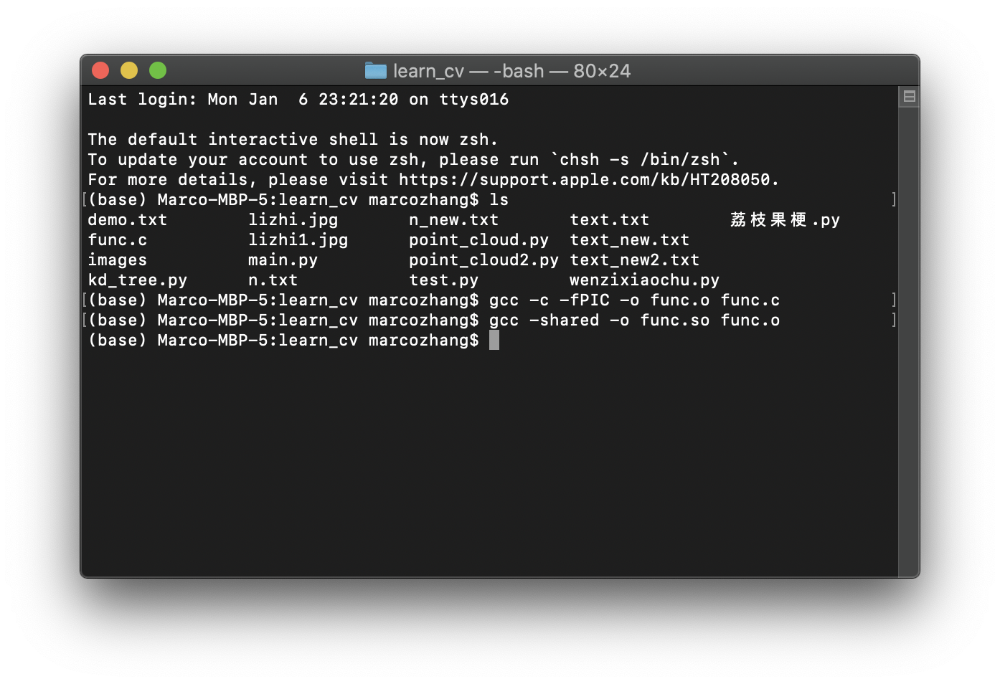

## 什么是KD Tree？

这是一种数据结构，能快速搜索最近点。大名鼎鼎的KNN算法就用到了KD-Tree。KD Tree的原理大致如下：

- 选择一个维度（x，y，z ......）
- 选出这些点这个维度值的中位数
- 将数据按中位数分为两部分
- 对这两部分数据同样执行上述操作，直到数据点的数目为 1

为了了解更详细的原理，建议参考：<https://zhuanlan.zhihu.com/p/45346117>

上述知乎专栏提供的样例代码：<https://github.com/tushushu/imylu/blob/master/imylu/utils/kd_tree.py> 以及 <https://github.com/tushushu/imylu/blob/master/examples/kd_tree_example.py>

## 如何在点云去噪中使用KD Tree算法

参考：<https://blog.csdn.net/u012348774/article/details/79495031>

上方参考博客提供的源代码地址：<https://github.com/Yannnnnnnnnnnn/kd_filter>

**但是上面那位仁兄用的C语言写的！！！我快看吐了，口区。**

使用KD Tree进行点云去噪，大致思路：

- 构建KD树
- 随机取点求解平均距离
- 将所有距离超出平均距离两倍的点删掉

详细思路如下：

- （1）根据点云数据生成k-d树，建立点云的拓扑关系；
- （2）查找任一点的的邻域；
- （3）计算该点与邻域内各点的距离取平均值；
- （4）判断该平均值是否超过阈值，若超过则判定该点为噪点，进行去除。

**找到一个用Python实现的：**<https://blog.csdn.net/daringpig/article/details/79721474>

先睡觉，明天再认真看。（2020.01.07 0:30留）

## 如何在Python中对C语言函数进行调用

例如：我们有一个名为func.c的C语言文件，里面有一个函数实现对输入的a进行a*a的计算，具体代码如下：

```c
/* func.c */
int func(int a)
{
        return a*a;
}
```

要想调用这个函数，首先，我们需要对这个c文件进行编译，输出.o文件（object，目标文件）以及.so（共享库文件）。对于macOS和Linux系统，我们依次使用命令如下：

```
$gcc -c -fPIC -o func.o func.c
$gcc -shared -o func.so func.o
```



- -c表示只编译(compile)，而不连接。-o选项用于说明输出(output)文件名。gcc将生成一个目标(object)文件mystack.o。

- 注意： -fPIC选项。PIC指Position Independent Code。共享库要求有此选项，以便实现动态连接(dynamic linking)。

这样，在目录里就会出现一个func.o和func.so文件。然后，我们在Python中写如下代码来测试我们对C语言函数的调用是否成功，代码如下：

```python
from ctypes import cdll

import os

p = os.getcwd() + '/func.so' #注意，这里加一个/符号是必要的，表示当前目录
f = cdll.LoadLibrary(p)

print(f.func(99))
```

可以看到终端返回的结果是9801，成功。

参考资料：https://www.cnblogs.com/vamei/archive/2013/04/04/2998850.html

（备注：如果你使用Xcode写C语言，当对点云数据使用C语言版本的KD Tree进行去噪的过程中，遇到Xcode无法include malloc.h，提示malloc.h file not found的时候，可以把语句改为：\#include <mm_malloc.h>）

## 对于C语言main函数中argc和argv[]的理解

- argc是传入参数的个数，它等于”传入的参数“加上可执行文件的文件名；
- argv[]存放的是传给main函数的参数，argv是字符串数组，所以下标从0开始，第一个存放的是可执行程序的文件名字，然后依次存放传入的参数

例子：

对于如下代码：

```c
#include <stdio.h>
int main(int argc, char *argv[])
{
		int i;
		for(i = 0; i < argc; i ++)
		{
				printf("argument(%d) is %s!\n", i, argv[i]);
		}
		
		printf("==========\n");
		printf("argc is %d\n", argc);
		printf("==========\n");
}
```

在运行时我们打入命令`./main s b d c h s` ，我们可以得到如下结果：

```
argument(0) is ./main!
argument(1) is b!
argument(2) is d!
argument(3) is c!
argument(4) is h!
argument(5) is s!
==========
argc is 6
==========
```


## 今天干了什么

```
1）找到了用C语言实现的KD Tree点云去噪代码，实在没有精力把他转成Python。想试图跑一下，但还没跑通。
2）为了避免把C转换成Python的麻烦工序，用了ctypes库实现了Python调用C的函数，但还没和kdtree.c联合在一起用（毕竟连kdtree.c都跑不起来）
3）解决了malloc.h在macOS的Xcode上无法include的问题。但是在windows上跑的话，就要把kdtree.c中的<mm_malloc.h>改为<malloc.h>
```

